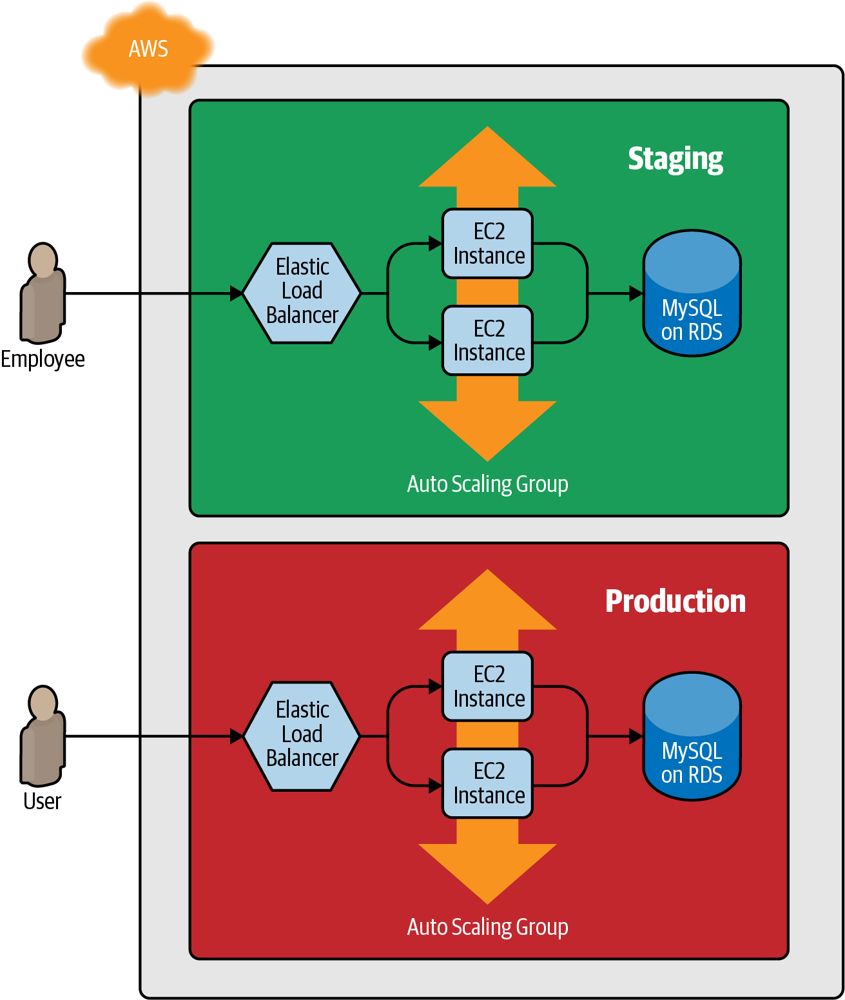

# How to Create Reusable Infrastructure with Terraform Modules


개발을 진행하면서 최소 2개의 환경이 필요하다.  
- testing용 staging 환경
- production 환경

두 환경은 비슷하지만 staging 환경은 비용적으로 조금 더 작은 규모로 구성될 것이다.




이때, 코드를 copy/paste 없이 비슷하게 환경을 구성할 수 있을까?  


Ruby와 같은 일반적인 프로그래밍 언어는 함수를 만들어서 해당 함수를 사용함으로써 코드의 중복을 줄일 수 있다.  

```ruby
# Define the function in one place
def example_function()
  puts "Hello, World"
end

# Use the function in multiple other places
example_function()
```

Terraform에서는 코드를 Terraform module에 넣고 재사용할 수 있다.  



이로써, Terraform으로도 재사용 가능한, 관리에 용이한, 테스트하기 좋은 코드를 작성할 수 있다.  

# Module Basics
어떠한 Terraform configuration file이 들어간 폴더들도 모듈이 될 수 있다.  

기존 코드들을 모듈로 재작성하기 위해 top-level 폴더로 modules를 생성하고 webserver-cluster에 존재하던 모든 파일들을 이동시킨다.  

이때 provider 정의는 모두 제거한다.  
- provider는 반드시 root 모듈에 작성되어야 한다.  




이제 다른 환경에서 해당 모듈을 사용할 수 있다.  

```terraform
module "<NAME>" {
  source = "<SOURCE>"

  [CONFIG ...]
}
```
- NAME: 해당 모듈을 참조할 때 사용할 이름
- SOURCE: 모듈 코드가 존재하는 경로
- CONFIG: 모듈에 전달할 값

예를 들어 stage/services/webserver-cluster에서 webserver-cluster 모듈을 사용하려면 아래와 같이 구성하면 된다.
```terraform
provider "aws" {
  region = "us-east-2"
}

module "webserver_cluster" {
  source = "../../../modules/services/webserver-cluster"
}
``` 
- production에서도 같은 형태로 구성할 수 있다!  

> 모듈을 추가하거나 모듈 내부의 source를 수정하면 `init`명령을 다시 수행해야 한다.  

webserver-cluset 모듈을 실행하기 전 모든 이름들이 하드코딩 되어있는 것을 수정해야 한다.  
- 같은 계정에 해당 모듈을 두 개 이상 배포한다면 conflict error가 발생할 것이다.  

# Module inputs 
일반적인 프로그래밍 언어에서는 함수를 설정 가능하게 하기 위해서는 parameter로 값을 넘겨준다.  

```ruby
# A function with two input parameters
def example_function(param1, param2)
  puts "Hello, #{param1} #{param2}"
end

# Pass two input parameters to the function
example_function("foo", "bar")
```

Terraform에서도 모듈에 값을 전달할 수 있다.  
### modules/services/webserver-cluster/variables.tf

```terraform
variable "cluster_name" {
  description = "The name to use for all the cluster resources"
  type        = string
}

variable "db_remote_state_bucket" {
  description = "The name of the S3 bucket for the database's remote state"
  type        = string
}

variable "db_remote_state_key" {
  description = "The path for the database's remote state in S3"
  type        = string
}
```
variables 파일에 작성된 값을 모듈 main.tf에서 사용할 수 있다. 
- `var.cluster_name`

```terraform
resource "aws_security_group" "alb" {
  name = "${var.cluster_name}-alb"

  ingress {
    from_port   = 80
    to_port     = 80
    protocol    = "tcp"
    cidr_blocks = ["0.0.0.0/0"]
  }

  egress {
    from_port   = 0
    to_port     = 0
    protocol    = "-1"
    cidr_blocks = ["0.0.0.0/0"]
  }
}
```

모듈에 값을 전달하기 위해서는 모듈 선언시 아래와 같이 구성하면 된다.  

```terraform
module "webserver_cluster" {
  source = "../../../modules/services/webserver-cluster"

  cluster_name            = "webservers-stage"
  db_remote_state_bucket  = "(YOUR_BUCKET_NAME)"
  db_remote_state_key     = "stage/data-stores/mysql/terraform.tfstate"
}
```

이름을 변경하는 동작 이외에 비용을 절감하기 위해 크기에 대한 값도 모듈에 전달하고 싶을 수 있다.  
이때는 number type을 전달하면 된다.

```terraform

variable "instance_type" {
  description = "The type of EC2 Instances to run (e.g. t2.micro)"
  type        = string
}

variable "min_size" {
  description = "The minimum number of EC2 Instances in the ASG"
  type        = number
}

variable "max_size" {
  description = "The maximum number of EC2 Instances in the ASG"
  type        = number
}
```


# Module locals 
# Module outputs 
# Module gotchas 
# Module versioning